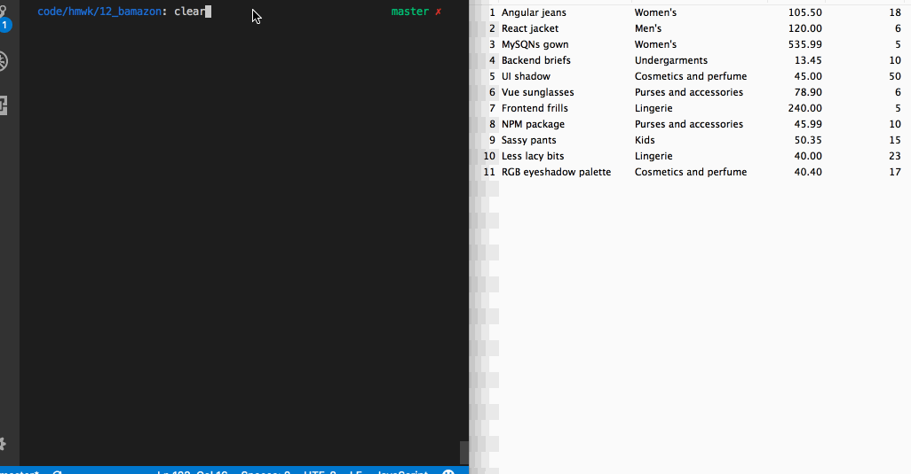
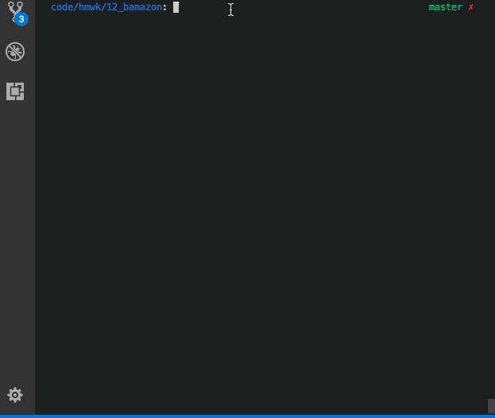
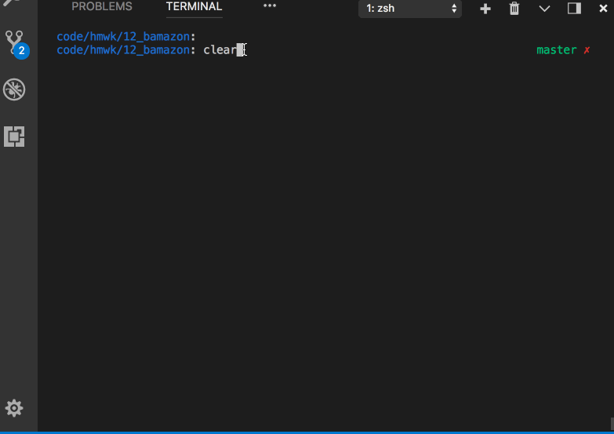

# KaBamazon: Katy's Bamazon
A storefront on the CLI using Node and MySQL

## CUSTOMER PORTAL:

The Customer portal displays a table with the items, their ids, and the amount for each product.

In the screencast below, the customer chooses a product by entering the id and how much the of the item the customer wants. If the id is valid and there is enough stock, the customer gets a receipt for the order, which includes Texas sales tax and an option to shop again. 

LICEcap of customer portal:

## MANAGER PORTAL:

The manager has several options. 

In the screencast below, the manager selects two options. The first one returns a table of all of the stock (ids, product names, quantity) in her store. Items that are below par are highlighted. 
The second option returns just those items low in stock. 

LICEcap of manager portal (view all stock & view low stock functions):

In the screencast below, the manager can add more (quantity) to an item that is already in the inventory. She can also add a completely new product.

LICEcap of manager portal (add to existing item & add a new product):

Packages used:

* Inquirer
* MySQL
* CLI-table
* Colors
